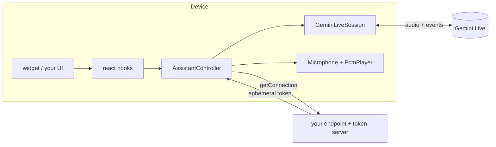

# Live Assistant

A real-time voice assistant for React Native apps (iOS, Android and the web).
You provide a token and a few tools. The library handles the microphone, the
speaker, interruptions, the transcript and the tool calls. You can drop in the
ready-made widget, or build your own UI on the headless hooks.

v1 runs on **Gemini Live**. The session is written against a provider-neutral
port, so other realtime providers can be added without changing your UI.

| Package | What it is | Where it runs |
|---|---|---|
| `@live-assistant/react-native` | **One install for an app**: everything below except the token server, re-exported | client (React Native / Expo) |
| `@live-assistant/core` | The controller, the session port, tools, transcript, levels | anywhere |
| `@live-assistant/gemini` | The Gemini Live session (socket, handshake, frames) | client |
| `@live-assistant/audio` | Microphone and speaker for iOS, Android and the web | client (React Native) |
| `@live-assistant/react` | Headless hooks: state, transcript, per-frame levels, tools | client (React) |
| `@live-assistant/widget` | A drop-in orb and panel, themed and worded by you | client (React Native / web) |
| `@live-assistant/token-server` | Mints short-lived Gemini tokens, so your API key never ships | your server (Node ≥ 18) |

## Where it runs

| Target | Supported | What carries the audio |
| --- | --- | --- |
| iOS, Android — React Native or Expo | yes | `react-native-audio-api` (a native module: development build, not Expo Go) |
| Web in an Expo / React Native Web app | yes | Web Audio; Metro picks the `.web` halves |
| Plain React on the web — Vite, Next, webpack | yes, without the widget | Web Audio; the `browser` field picks the `.web` halves. `@live-assistant/widget` needs React Native Web, the rest does not |
| Node, on your server | `@live-assistant/token-server` only | nothing — it mints tokens |

`getUserMedia` exists only in a secure context, so any web target must be served
from `https://` or `localhost`.



## Which package

An app installs one thing:

```sh
npm install @live-assistant/react-native
```

and a server installs the other:

```sh
npm install @live-assistant/token-server
```

Reach past the umbrella when you want less than all of it — a custom UI needs
`core` and `react` without the widget, and a headless integration needs
neither. The pieces are split because each split costs somebody something: the
token server must not drag React Native onto a server, the audio package
carries a native dependency that means a rebuild, and the widget is a UI
anyone drawing their own should be able to leave out.

**The umbrella is not free if you only want part of it.** It re-exports with
`export *` from a CommonJS build, and Metro does not tree-shake, so importing
anything from it pulls all five members into your bundle. Measured on an Expo
web export of an app whose only import is `AssistantController`:

| Imported from | Bundle | Carries |
|---|---|---|
| `@live-assistant/react-native` | 604 KB | the orb, panel, transcript, the Gemini session, the web microphone |
| `@live-assistant/core` | 344 KB | none of them |

So install the umbrella when you use the widget, and name the packages you
import when you draw your own UI.

## Install and set up

Three steps, and none of them can be skipped: the package, the native audio
module's configuration, and a server route that mints tokens.

### 1. Install

```sh
npm install @live-assistant/react-native react-native-audio-api   # in the app
npm install @live-assistant/token-server                          # on your server
```

`react-native-audio-api` is a **peer dependency and a native module**. Two
consequences:

- **Expo Go cannot run this.** It ships a fixed set of native modules and this is
  not one of them. Use a development build: `npx expo prebuild && npx expo run:ios`
  (or `run:android`), or EAS Build.
- Adding it means a rebuild, not just a restart.

The web needs no native module — `@live-assistant/audio` uses Web Audio there —
but `getUserMedia` only exists in a **secure context**, so the page must be on
`https://` or `localhost`.

### 2. Configure the microphone — one line

```json
{
  "expo": {
    "plugins": [
      [
        "@live-assistant/react-native",
        { "microphonePermission": "Acme uses your microphone so you can talk to the assistant." }
      ]
    ]
  }
}
```

That is the whole native setup. The plugin ships with the library and writes what
a voice assistant actually needs — verified by running `expo prebuild` and
reading the generated files, not the config:

| Generated | Value |
| --- | --- |
| `NSMicrophoneUsageDescription` | your sentence — without it iOS terminates the app at the first microphone request |
| `UIBackgroundModes` | **absent**. `react-native-audio-api`'s own default adds `["audio"]`, which App Review rejects under guideline 2.5.4 when nothing plays in the background |
| `android.permission.RECORD_AUDIO` | present |
| foreground service | none |

**Do not also list `react-native-audio-api` in `plugins`.** Its plugin runs once,
so whichever is listed first wins — and if that is theirs, you get the defaults
this one exists to avoid.

Need background audio for real? Configure `react-native-audio-api` yourself
instead of using this plugin, and be ready to justify the background mode.

**Without Expo config plugins** (a bare React Native app), add
`NSMicrophoneUsageDescription` to `ios/<App>/Info.plist` by hand. `RECORD_AUDIO`
arrives through the module's own manifest merge on Android.

### 3. Mint tokens on your server

The app never holds your Gemini API key. It calls your endpoint, your endpoint
mints a short-lived token, and that token is what reaches Gemini — see the quick
start below for both halves.

## A working example

[`examples/expo-app`](examples/expo-app) is a whole integration in one file —
the real session, microphone, player, a tool and the widget, with one endpoint
to point at your own server. CI typechecks and bundles it against the library in
this repository on every pull request, so it cannot quietly stop being true.

```sh
git clone https://github.com/Recipely-Team/live-assistant && cd live-assistant
npm install
npm run build:web -w @live-assistant/example-expo-app
```

## Quick start (with the widget)

**1. On your server**, mint a token after your own auth:

```ts
import { mintGeminiLiveToken } from '@live-assistant/token-server';

app.post('/assistant/token', requireUser, async (req, res) => {
  const minted = await mintGeminiLiveToken({
    apiKey: process.env.GEMINI_API_KEY!,
    model: 'models/gemini-3.1-flash-live-preview',
    systemInstruction: 'You are the assistant inside Acme Notes. Be brief.',
    tools: toolDefinitions, // the same definitions the app registers handlers for
    voiceName: 'Aoede',
    languageCode: req.body.languageCode ?? 'en-US',
    resumptionHandle: req.body.resumptionHandle,
  });
  if (!minted.ok) return res.status(503).json({ error: minted.failure.code });
  res.json(minted.value);
});
```

**2. In the app**, build the controller once and render the widget near the root:

```tsx
import { AssistantController, ToolRegistry } from '@live-assistant/core';
import { GeminiLiveSession } from '@live-assistant/gemini';
import { Microphone, PcmPlayer } from '@live-assistant/audio';
import { AssistantProvider } from '@live-assistant/react';
import { AssistantWidget } from '@live-assistant/widget';

const tools = new ToolRegistry([
  {
    definition: {
      name: 'createNote',
      description: 'Creates a note with the given text',
      parameters: { type: 'object', properties: { text: { type: 'string' } }, required: ['text'] },
    },
    run: async ({ text }) => ({ ok: true, id: await notes.create(String(text)) }),
  },
]);

const assistant = new AssistantController({
  session: new GeminiLiveSession(),
  microphone: new Microphone(),
  player: new PcmPlayer(),
  tools,
  getConnection: async ({ resumptionHandle }) => {
    const response = await fetch('/assistant/token', {
      method: 'POST',
      body: JSON.stringify({ resumptionHandle, languageCode: 'en-US' }),
    });
    if (!response.ok) throw await response.json(); // comes back as failure.cause
    return response.json();
  },
});

export function App() {
  return (
    <AssistantProvider controller={assistant}>
      <Navigation />
      <AssistantWidget />
    </AssistantProvider>
  );
}
```

## Customising the widget

```tsx
<AssistantWidget
  placement="bottom-left"
  theme={{ colors: { primary: '#E4572E', assistantGlow: '#FFB400' }, radius: 8 }}
  strings={{ status: { listening: 'Dinliyorum' }, stop: 'Bitir', errors: { microphone_denied: 'Mikrofon kapalı' } }}
  renderMessage={(entry, fallback) => (
    <Row>
      <Avatar who={entry.speaker} />
      {fallback}
    </Row>
  )}
  renderTool={(entry) => (entry.status === 'succeeded' ? <DoneChip name={entry.call.name} /> : null)}
/>
```

- **`theme`** overrides colours, orb size, radius, spacing, font size and panel height. Anything you leave out keeps the default.
- **`strings`** overrides every word the widget shows or reads out, including statuses, errors, end reasons and tool chips. The defaults are in English.
- **`renderMessage` / `renderTool`** receive each transcript entry together with the default rendering (`fallback`), so you can wrap it, replace it, or hide it.
- `AssistantOrb` (starts/stops on its own unless you pass `onPress`), `AssistantPanel`, `AssistantTranscript`, `StatusLine`, `AssistantControls`, `AssistantComposer`, `MessageBubble` and `ToolChip` are also exported, so you can compose your own layout from them. Inside your own parts, `useWidgetTheme()` and `useWidgetStrings()` read the merged theme and strings.

## Headless (your own UI)

Everything the widget draws with is public, and nothing in it is private to the widget:

```tsx
import { useAssistant, useLevelFrames, useTranscript } from '@live-assistant/react';

function MyAssistantBar() {
  const { status, isMuted, error, start, stop, toggleMute, sendText } = useAssistant();
  const transcript = useTranscript(); // entries: { kind: 'message', speaker, text, isFinal } | { kind: 'tool', call, status }

  const userRing = useRef(new Animated.Value(0)).current;
  const assistantGlow = useRef(new Animated.Value(0)).current;
  useLevelFrames(({ input, output }) => {
    // Called every animation frame; nothing re-renders.
    userRing.setValue(input);      // the user talking
    assistantGlow.setValue(output); // the assistant talking (what is heard)
  });
  // …
}
```

- **Levels are never React state.** `useLevelFrames` gives you both levels (0–1) on every frame, for effects that follow each voice. `useAssistantLevels()` hands you the raw sources instead, if your animation library polls on its own clock. `smoothLevel` from core gives frame-rate-independent easing.
- **The output level follows the playhead.** A reply arrives seconds before it is heard, so the level tracks what is playing now, not what has just arrived.
- **`useAssistantState(selector)`** re-renders only when the slice you selected changes.
- **`useAssistantTool(tool)`** registers a screen-specific tool while that component is mounted. The model has to know the tool already, so declare it when you mint the token.
- Without React, `AssistantController` works on its own: `start()`, `stop()`, `setMuted()`, `sendText()`, `subscribe()`/`getState()` (compatible with `useSyncExternalStore`), `inputLevel` and `outputLevel`.

## What the controller takes care of

These behaviours are built in, and each one fixes a problem seen in production:

- **Start order.** It asks for the microphone before spending a token, and subscribes before connecting.
- **Abandoned starts.** Calling `stop()` while a session is starting releases everything that was opened.
- **Interruptions.** When the user talks over the assistant, the unheard audio is dropped.
- **Echo.** Where a platform cannot cancel echo (Android's default recorder), the microphone is held shut while the assistant is audible.
- **Transcript.** Fragments are joined into messages. `thinking` is shown between the user finishing and the reply starting, and `no_answer` is raised when nothing comes back.
- **Tool calls.** They run one at a time, and every call is answered, including unknown names and handlers that throw. Calls the model withdraws never run.
- **Handovers.** When the provider hands the session over (`goAway`), it reconnects through `getConnection({ resumptionHandle })` with a limit on attempts.
- **Silence.** Sessions end after a quiet spell (90 s by default; configurable, or `null` to never end), because an open microphone is billed.

## Errors

Failures come back as codes, never as user-facing text. The widget maps them through `strings.errors`, and your own UI maps them however it likes:

`microphone_denied` · `microphone_unavailable` · `player_unavailable` · `connection_refused` (your `getConnection` threw; the thrown value is in `cause`) · `connection_lost` · `connect_timed_out` · `socket_failed` · `closed_before_ready` · `no_answer`

## Notes

- **Audio.** `@live-assistant/audio` needs `react-native-audio-api` (≥ 0.13.3) on native. On the web it uses Web Audio. On iOS the session runs in `voiceChat` mode, which gives echo cancellation. Android's recorder has none, which is why the controller's echo gate exists.
- **Widget requirements.** The widget needs React Native 0.76 or later. The panel's shadow uses `boxShadow`, which renders on the New Architecture and on the web; on the old architecture the panel simply has no shadow. Pass safe-area insets through `style` (for example `style={{ bottom: insets.bottom + 16 }}`) so the orb clears the iOS home indicator.
- **Model names.** Verify the model you configure. A model can appear in the model list and still not be callable.
- **Configuration lives in the token.** Gemini fixes the session setup when the token is minted, and a setup sent by the client is discarded.

## When it does not work

| What you see | What it is |
| --- | --- |
| `microphone_denied` | The user declined, or `NSMicrophoneUsageDescription` is missing so iOS never asked. Check the generated `Info.plist`, not `app.json` |
| `microphone_unavailable` on a device | The native module is not in the binary. Expo Go cannot load it; rebuild with a development build |
| `microphone_unavailable` in a browser | The page is not a secure context. `getUserMedia` needs `https://` or `localhost` |
| `connection_refused` | Your `getConnection` threw. The thrown value is on `failure.cause` — usually your token route answering 401 or 503 |
| `connect_timed_out` / `socket_failed` | The token was minted but the socket did not come up. Check the `model` you minted with actually exists for your key: a model can be listed and still not be callable |
| `closed_before_ready` | Gemini closed during the handshake. Almost always a token that was already used — they are single-use |
| `no_answer` | The model produced nothing for a turn. Usually the tools you declared at mint time do not match what the app registered |
| Nothing is heard, no error | The token was minted without audio output, or the player was never prepared. Check `AssistantStatus` reaches `speaking` |
| It works on iOS and echoes on Android | Expected: Android's recorder has no echo cancellation, so the controller holds the microphone shut while the assistant is audible. Do not send audio yourself while `speaking` |
| On the web, `start()` never settles | The session was started outside a user gesture. A browser leaves `AudioContext.resume()` pending until the page has been interacted with, so start from a press — which is what the orb already is |
| The assistant answers a recipe you mentioned earlier, not the one on screen | A tool-design problem, not a library one: give your screen-reading tools the current screen's state, not the conversation's memory |

Failures are codes, never sentences (`AssistantFailureCode`). If you are showing
one to a person, map it yourself — the library has no user-facing copy.

## Developing

```sh
npm install
npm run check      # lint, typecheck, build, test, and pack every package
```

The seven packages live in one npm workspace and share one version number.
[`CONTRIBUTING.md`](CONTRIBUTING.md) has the layout, the standards and the
release steps.

## Licence

MIT — see [LICENSE](LICENSE).
